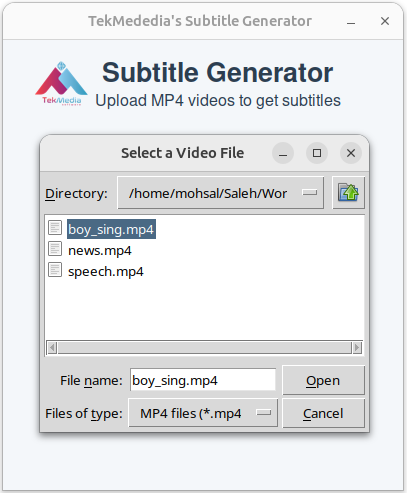

# Subtitle Generator

A powerful tool that automatically generates multilingual subtitles for videos using OpenAI's Whisper model and FFMPEG. This application extracts audio from a video, transcribes it, translates subtitles, and embeds them directly into the video, making content more accessible to global audiences.

## Features
- Automatic transcription of video audio using Whisper.
- Multilingual subtitle generation with options for translation.
- Embeds subtitles directly into the video as soft subtitles.
- Simple GUI for easy video file selection and subtitle customization.

## Requirements
- Python 3.8+
- FFMPEG
- VLC Media Player
- Required Python libraries listed in `requirements.txt`

## Usage
1. Install the required packages (see [INSTALL.md](INSTALL.md) for details).
2. Run the application: `python app.py`.
3. Select a video file, choose subtitle language, and generate subtitles.

## Sample Screenshots

## Contact 

For any questions or feedback, please reach out:

- Nikileshwar Anbukumaran - [nikanb@tekmediasoft.net](mailto:nikanb@tekmediasoft.net)

## Acknowledgements

- Thanks to [FFMPEG](https://github.com/FFmpeg/FFmpeg) for providing functionality that was crucial to this project.
- Thanks to [Eyevinn](https://github.com/Eyevinn/auto-subtitles) for providing the base idea to develop this project.
- Thanks to [OpenAI](https://github.com/OPENAI) for offering powerful language models that assist in developing and refining features like subtitle generation and translation.
- Thanks to [Google](https://github.com/google) for the googletrans library, enabling multilingual subtitle translations.
- Thanks to [VideoLAN](https://github.com/videolan) for VLC, which powers video playback within the application.

## Contributing

We welcome contributions! Please see the [CONTRIBUTING.md](CONTRIBUTING.md) file for detailed guidelines on how to contribute to this project.

## License

This project is licensed under a proprietary license. All rights reserved. You may modify and use this software for personal purposes, but for any production use, reproduction, modification, or distribution, prior written permission from **TekMedia Software Services** is required.

## Contact 

For any questions or feedback, please reach out:

- Awadh Bajpai - [awabaj@tekmediasoft.net](mailto:awabaj@tekmediasoft.net)
- Nikileshwar Anbukumaran - [nikanb@tekmediasoft.net](mailto:nikanb@tekmediasoft.net)

## Acknowledgements

- Thanks to [FFMPEG](https://github.com/FFmpeg/FFmpeg) for providing functionality that was crucial to this project.

## Contributing

We welcome contributions! Please see the [CONTRIBUTING.md](CONTRIBUTING.md) file for detailed guidelines on how to contribute to this project.

## License

This project is licensed under a proprietary license. All rights reserved. You may modify and use this software for personal purposes, but for any production use, reproduction, modification, or distribution, prior written permission from [**TekMedia Software Services**](https://tekmediasoft.com) is required.

